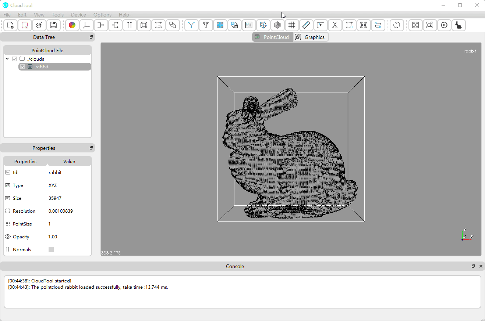
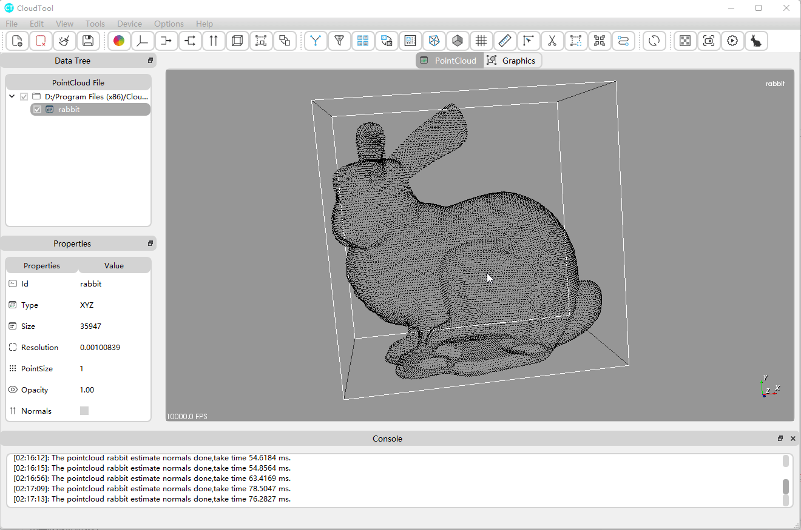
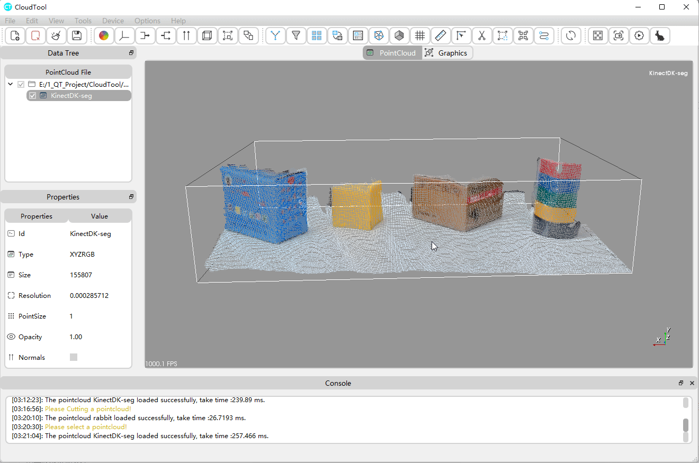
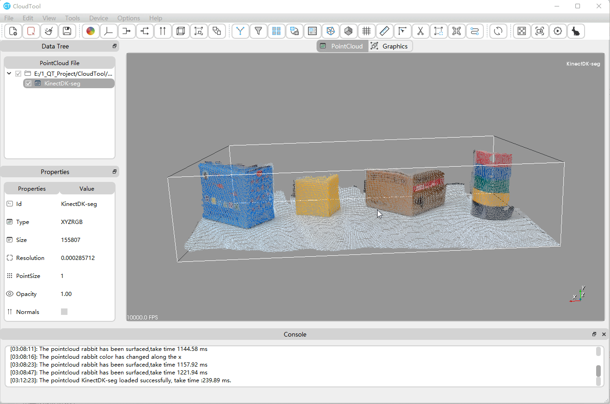
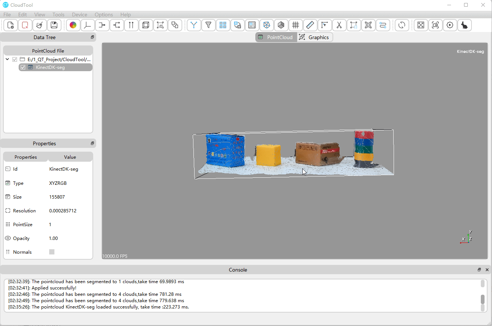
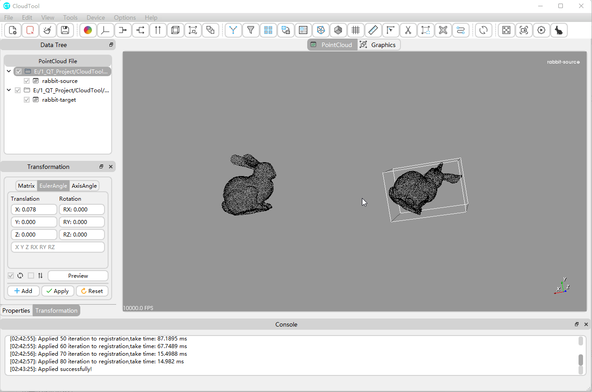

## CloudTool
A 3D point cloud processing software base on PCL and QT;


## Preview

### 1. Color



### 2. Normals


### 3. Filters



### 4. Cutting



### 5. Measure



### 6. Segmetation



### 7. Registration



### 8. Surface


## Depend on
| Dependencies | Min Version |
| ------------ | ------- |
| QT           | 5.12.0  |
| PCL          | 1.11.0  |
| VTK (WITH_QT)          | 8.2.0   |

## How to build
### Windows

Compilers：MSCV2019

```shell
mkdir build
cd build
cmake -DCMAKE_PREFIX_PATH=D:\Qt\5.15.2\msvc2019_64 -Wno-dev  ..
cmake --build . --config Release --target cloudtool -j 14 --
cmake --build . --config Release --target install 
```

### Ubuntu 20.04

Compilers：GUN

```shell
mkdir build
cd build
cmake .. 
make -j 14
make install
```
