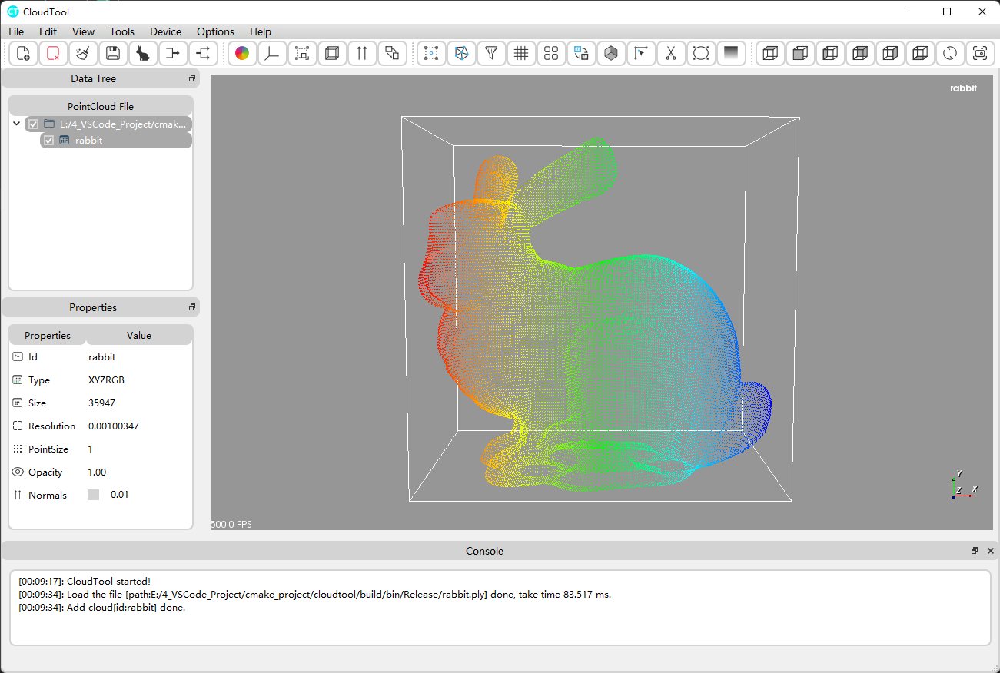

## CloudTool
A 3D point cloud processing software base on PCL and QT;



## Depend on
| Dependencies | Version |
| ------------ | ------- |
| QT           | 5.15.2  |
| PCL          | 1.11.1  |
| VTK          | 8.2.0   |

## How to build
### Windows

Compilers：MSCV2019

```shell
mkdir build
cd build
cmake -DCMAKE_PREFIX_PATH=D:\Qt\5.15.2\msvc2019_64 -Wno-dev  ..
cmake --build . --config Release --target cloudtool -j 14 --
cmake --build . --config Release --target install 
```

### Ubuntu 20.04

Compilers：GUN

```shell
mkdir build
cd build
cmake .. 
make -j 14
make install
```
